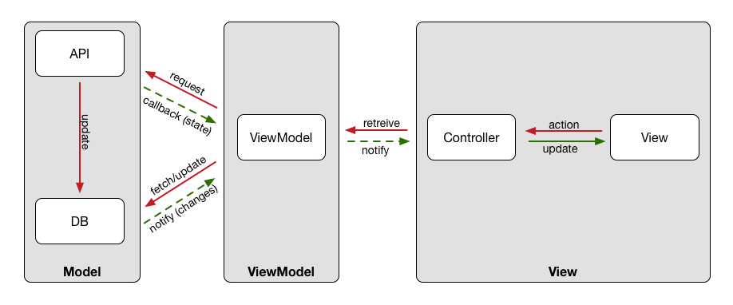

   

## Ideas

MVVM is a specialization of the [Presentation Model](https://msdn.microsoft.com/en-us/library/ff921080.aspx) (or Application Model) for Microsoft's Silverlight and WPF. The main ideas behind this UI architectural pattern are:

- The view part is the only one that depends on the GUI framework. This means that for iOS, the view controller is part of the view.
- The view can only talk to the view model. Never to the model.
- The view model holds the state of the view. This state is offered to the view via view model properties. These properties contain not only the value of the labels, but also other view related information like if the save button is enabled or the color for a rating view. But the information of the state must be UI framework independent. So in the case of iOS, the property for the color should be an enum, for example, instead of a UIColor.
- The view model also provides methods that will take care of the UI actions. This actions will talk to the model, but they never change the state of the view that is data related directly. Instead, it talks to the model and asks for the required changes.
- The model should be *autonomous*, i.e. you should be able to use the same code for the model for a command line application and a UI interface. It will take care of all the business logic.
- The model doesn't know about the view model. So changes to the view model are propagated through an observation mechanism. For iOS and a model with plain NSObject subclasses or even Core Data, KVO can be used for that (also for Swift).
- Once the view model knows about changes in the model, it should update the state that it holds (if you use value types, then it should create an updated one and replace it).
- The view model doesn't know about the view. In its original conception it uses data binding, that not available for iOS. So changes in the view model are propagated through an observation mechanism. You can also use KVO here, or as you mention in the question, a simple delegation pattern, even better if combined with Swift property observers, will do. Some people prefer reactive frameworks, like [RxSwift](https://github.com/ReactiveX/RxSwift), [ReactiveCocoa](https://github.com/ReactiveCocoa/ReactiveCocoa), or even [Swift Bond](https://github.com/ReactiveKit/Bond).

> Special thanks to [Jorge Ortiz](https://twitter.com/jdortiz).

## The benifits

- **View models are testable.** Since they don't need a view to do their work, presentation behavior can be tested without any UI automation or stubbing.
- **View models can be used like models.** If desired, view models can be copied or serialized just like a domain model. This can be used to quickly implement UI restoration and similar behaviors.
- **View models are (mostly) platform-agnostic.** Since the actual UI code lives in the view, well-designed view models can be used on the iPhone, iPad, and Mac, with only minor tweaking for each platform.
- **Views and view controllers are simpler.** Once the important logic is moved elsewhere, views and VCs become dumb UI objects. This makes them easier to understand and redesign.

## Interactor

## What's in a View Model?

A view model is like an [adapter](http://en.wikipedia.org/wiki/Adapter_pattern) for the model that makes it suitable for presentation. The view model is also where presentation behavior goes.

For example, a view model might handle:

- Kicking off network or database requests
- Determining when information should be hidden or shown
- Date and number formatting
- Localization

However, the view model is not responsible for actually presenting information or handling input — that's the sole domain of the view layer. When the view model needs to communicate something to the view, it does so through a system of data binding.

## What's in a View?

OS X and iOS both have view (or window) controllers, which may be confusing at first glance, since MVVM only refers to a view.

But upon closer inspection, it becomes apparent that view controllers are *actually just part of the view layer*, since they handle things like:

- Layout
- Animations
- Device rotation
- View and window transitions
- Presenting loaded UI

So, "the view" actually means the view *layer*, which includes view controllers. There's no need to have a view and a view controller for the same section of the screen, though — just pick whichever class is easier for the use case.

No matter whether you decide to use a view or a view controller, you'll still have a view model.

